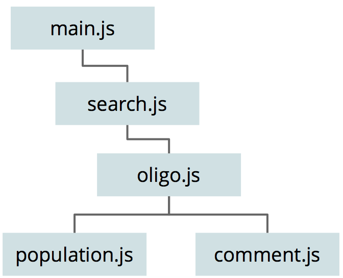

Source code
-----------

javascript
^^^^^^^^^^
The javascript files are related to the visible sections on the UI, and have
this calling structure:

(`diagram source <https://docs.google.com/a/soe.ucsc.edu/presentation/d/1mmP-8bTWGfXyDzrgTjeEtALT1WWSbUxaiZIrGntg2tQ/>`_)

Sorting
'''''''
Currently all sorts are in ascii/unicode order. It may be better to do a
case-insensitive sort in all sorted lists. This would mean changing the sort
algorthm on the server and client.

On the server so when there are more matches than can be sent to the
client in one response, the proper rows are selected for sending.

On the client to order drop-down lists, and to properly sort by any column in the
dataTable. There is no obvious way to change the sort algorthm in dataTables.

html
^^^^
The html files are related to the visible sections on the UI. They contain
django template directives that allow inclusion of other html files. The include
structure is like so:

(`diagram source <https://docs.google.com/a/soe.ucsc.edu/presentation/d/1mmP-8bTWGfXyDzrgTjeEtALT1WWSbUxaiZIrGntg2tQ/>`_)

css
^^^
The css files follow the library css files and cascade in this fashion:

(`diagram source <https://docs.google.com/a/soe.ucsc.edu/presentation/d/1mmP-8bTWGfXyDzrgTjeEtALT1WWSbUxaiZIrGntg2tQ/>`_)
